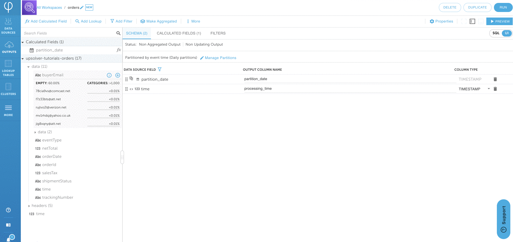

# Output all data source fields to Amazon Athena

## Background

Sometimes it is necessary to read a large number of fields from a data source and write these fields to Athena without any transformations.


This feature works well with a [CDC data source](../../../../connecting-data-sources/cdc-data-sources-debezium/mysql-cdc-data-sourcei.md).


## Create Amazon Athena output

1. Create an Athena output by clicking on **OUTPUTS &gt; NEW &gt; SELECT** Amazon Athena

2. Choose **Hierarchical** and click on **NEXT**.

3. Navigate to the SQL mode screen by clicking on **SQL** on the upper right corner.

## SELECT all fields from data source

Add `data.* as *` to your `SELECT` statement.

## Run the output

1. Click on **RUN** on the upper right corner

2. Enter the Athena information and click on **NEXT**

3. Choose your time range for your data. Never means a continuous stream. Click on **DEPLOY**.

## Verify data in Amazon Athena

