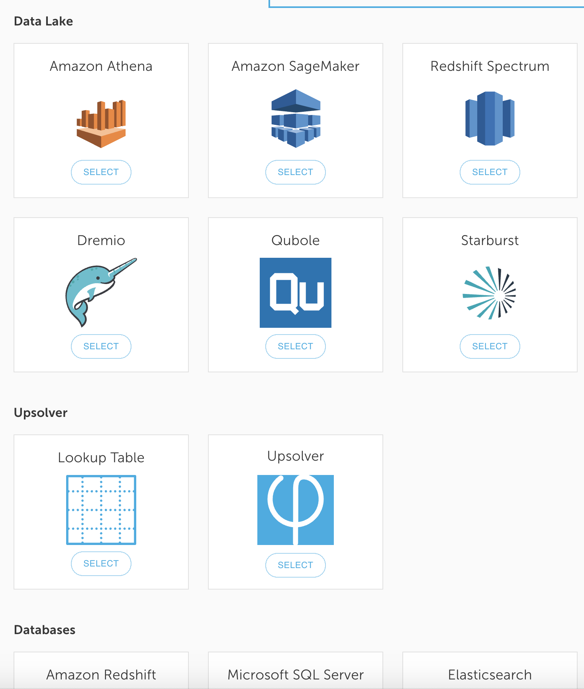

# Dremio


### **What is Dremio?**

Dremio is a data lake query engine that delivers  fast query speed and a self-service semantic layer operating directly against a data lake storage.


### Prerequisite

You must have Glue Catalog integrated with Dremio. Follow instructions [here](https://docs.dremio.com/data-sources/aws-glue-catalog.html) if you haven't integrated.

## Create a new data output

1. Create a new data output by clicking on **Output** and **New Output**.

2. Select **Dremio** as your output.

3. Provide a name for the data output. In this case, we will use the name `dremiotest`. Make sure it’s mapped to an existing data source; then click **Next**.

4. Choose the columns that you want to output to Dremio. By clicking on the plus iconnext to the field name. 

Add the following columns: 

* `aged_70_older` 
* `continent` 
* `date` 
* `new_cases`
* `population` 


There are many powerful capabilities available such as **aggregations**, **filters**, **calculations**, **lookup tables for joining**, ****and more. These features will be covered on a later guide. 


5. Click **Preview** to check that the output data is as expected, then click **Run**.

6. Make sure an existing Dremio database is available for the output. If not, create a new database. 

7. If you have not configured a glue catalog connection, create a glue catalog connection by clicking on **Create your first Glue Data Catalog Connection**

8. Fill out the Dremio database and table information for output then click **Next**.

9. Choose the time period for the data that you want to load then click **Deploy**.

